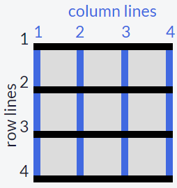

# CSS - Grid
CSS Grid helps you easily build complex web designs. It works by turning an HTML element into a grid container with rows and columns for you to place children elements where you want within the grid.

Turn any HTML element into a grid container by setting its `display` property to `grid`. This gives you the ability to use all the other properties associated with CSS Grid.

**Note:** In CSS Grid, the parent element is referred to as the *container* and its children are called *items*.

## Structure of the Grid

### Columns
Simply creating a grid element doesn't get you very far. You need to define the structure of the grid as well. To add some columns to the grid, use the `grid-template-columns` property on a grid container as demonstrated below:

```css
.container {
  display: grid;
  grid-template-columns: 50px 50px;
}
```

This will give your grid two columns that are each 50px wide. The number of parameters given to the `grid-template-columns` property indicates the number of columns in the grid, and the value of each parameter indicates the width of each column.

### Rows
The grid you created will set the number of rows automatically. To adjust the rows manually, use the `grid-template-rows` property in the same way you used grid-template-columns in previous part.

```css
.container {
  display: grid;
  grid-template-columns: 50px 50px;
  grid-template-rows: 50px 50px;
}
```

#### Units of Measurement for Columns & Rows
You can use absolute and relative units like `px` and `em` in CSS Grid to define the size of rows and columns. You can use these as well:
- `fr`: sets the column or row to a fraction of the available space
- `auto`: sets the column or row to the width or height of its content automatically
- `%`: adjusts the column or row to the percent width of its container.

Example:
```css
grid-template-columns: auto 50px 10% 2fr 1fr;
```

This snippet creates five columns. The first column is as wide as its content, the second column is 50px, the third column is 10% of its container, and for the last two columns; the remaining space is divided into three sections, two are allocated for the fourth column, and one for the fifth.

#### Column & Row Gap
So far in the grids you have created, the columns have all been tight up against each other. Sometimes you want a gap in between the columns. To add a gap between the columns, use the `grid-column-gap` property like this:

```css
grid-column-gap: 10px;
```

This creates 10px of empty space between all of our columns.

You can also add a gap in between the rows of a grid using `grid-row-gap` in the same way as previous.

However, `grid-gap` is a shorthand property for `grid-row-gap` and `grid-column-gap` that's more convenient to use. If `grid-gap` has one value, it will create a gap between all rows and columns. However, if there are two values, it will use the first one to set the gap between the rows and the second value for the columns.

### Grid Items
Up to this point, all the properties that have been discussed are for grid containers. The `grid-column` property is the first one for use on the grid items themselves.

The hypothetical horizontal and vertical lines that create the grid are referred to as *lines*. These lines are numbered starting with 1 at the top left corner of the grid and move right for columns and down for rows, counting upward.

This is what the lines look like for a 3x3 grid:


To control the amount of columns an item will consume, you can use the `grid-column` property in conjunction with the line numbers you want the item to start and stop at.

Here's an example:
```css
grid-column: 1 / 3;
```

This will make the item start at the first vertical line of the grid on the left and span to the 3rd line of the grid, consuming two columns.