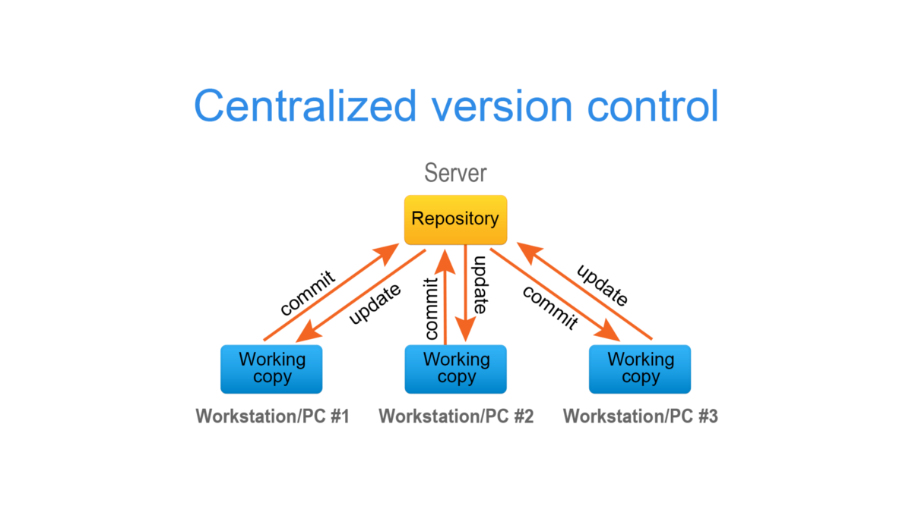

# Week 1 - Day 1

## Mozilla Web Resources - Best Official Resources 
Covers ALL web browsers: Firefox, Chrome, Edge, Explorer, Safari and more!

* https://developer.mozilla.org/en-US/
* https://developer.mozilla.org/en-US/docs/Web/HTML
* https://developer.mozilla.org/en-US/docs/Web/CSS
* https://developer.mozilla.org/en-US/docs/Web/javascript
* https://www.w3schools.com/ (unofficial)

## Code Editors
* https://code.visualstudio.com/
Alternatives: Atom, Notepad++, Gedit, vim, emacs, Sublime and many more

## Tools
* https://frontendmasters.com/books/front-end-handbook/2019/ Front-End Overview
* http://boringtechnology.club/
* https://web.stanford.edu/class/msande91si/www-spr04/readings/week1/InternetWhitepaper.htm How internet works (from 2002 but still basics are correct)
* https://itusts.wordpress.com/2017/04/07/how-does-the-internet-work/ How internet works
* https://www.freecodecamp.org/news/http-and-everything-you-need-to-know-about-it/ How HTTP (Hypertext Transfer Protocol) works

## Git

Distributed Version Control System - All Repositories are equal even your local one!

* https://git-scm.com/ Official Git site
* https://www.atlassian.com/git Git tutorial by Atlassian
* https://guides.github.com/ GitHub guide

* https://www.atlassian.com/git/tutorials/what-is-git
* https://www.atlassian.com/git/tutorials/learn-git-with-bitbucket-cloud

From https://medium.com/@eduoshaun/difference-between-git-and-github-807f1a57d438

## Edit/Move Files in local clone from command line terminal
* git status for status
* git add . from project root to stage changes
* git status to make sure
* git commmit -m "My helpful commit message" to commmit **locally**
* git push origin to push back to master repo (Github will ask to login and pw if no SSH set)

## If you want to work on specific revision
* git clone URL 
* cd to Projectdirectory
* git reset --hard SHA1 where SHA1 is SHA1 of the revision you want

* git pull to get back to HEAD revision

### Various workflows: https://www.atlassian.com/git/tutorials/comparing-workflows

### Git Cheatsheet

* https://www.atlassian.com/dam/jcr:8132028b-024f-4b6b-953e-e68fcce0c5fa/atlassian-git-cheatsheet.pdf

### Git Basics in 10 minutes
* https://www.freecodecamp.org/news/learn-the-basics-of-git-in-under-10-minutes-da548267cc91/
* https://www.freecodecamp.org/news/git-the-laymans-guide-to-understanding-the-core-concepts/

### Git Graphical Clients
* https://git-scm.com/downloads/guis

## Git support in Visual Studio Code
* https://code.visualstudio.com/docs/editor/versioncontrol

## Git Bash commands
* https://www.atlassian.com/git/tutorials/git-bash

### How to Git Init locally then push later to Remote (such as Github)

* https://help.github.com/en/articles/adding-an-existing-project-to-github-using-the-command-line